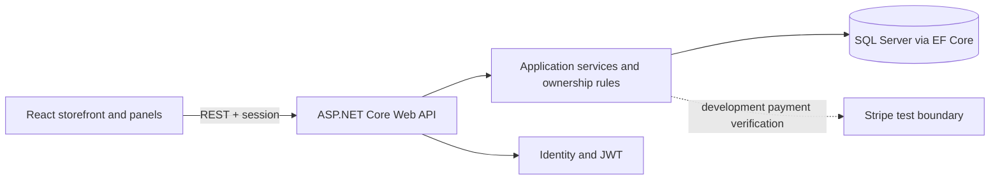
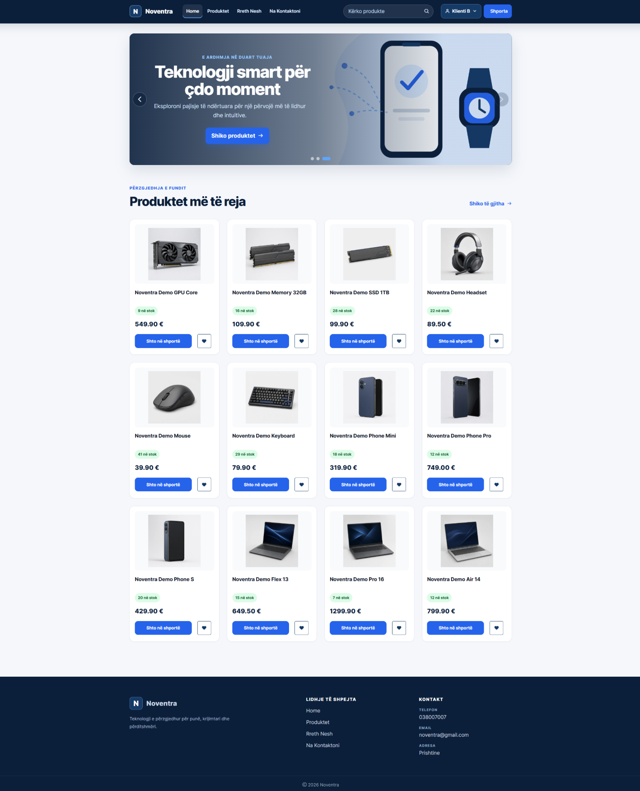
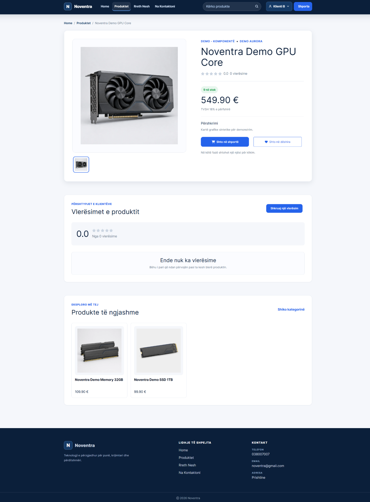
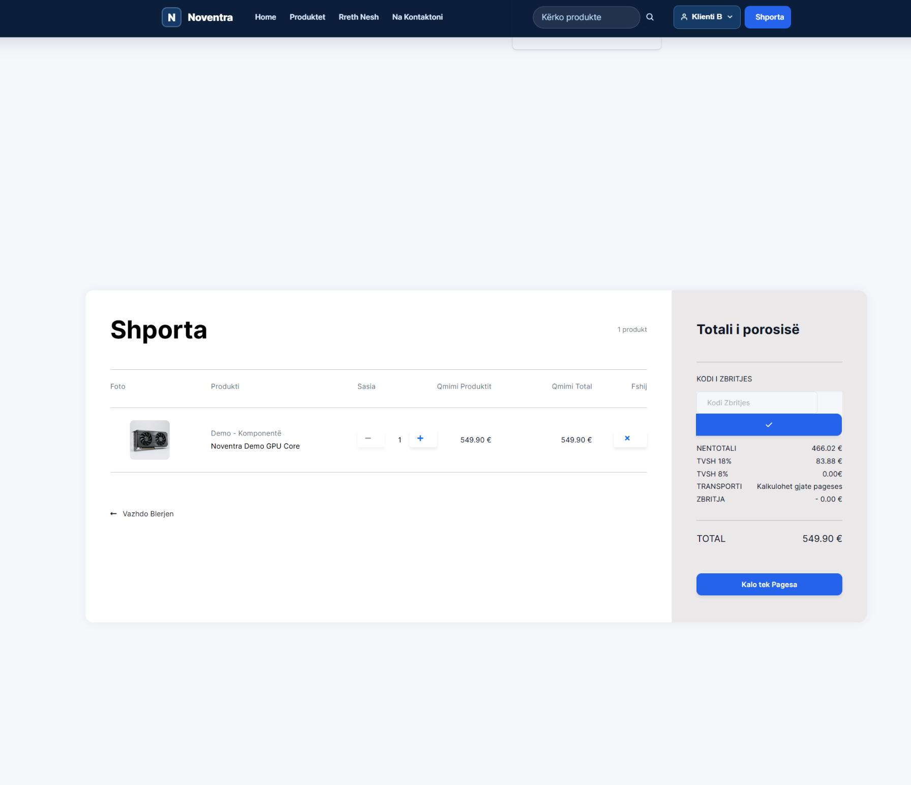
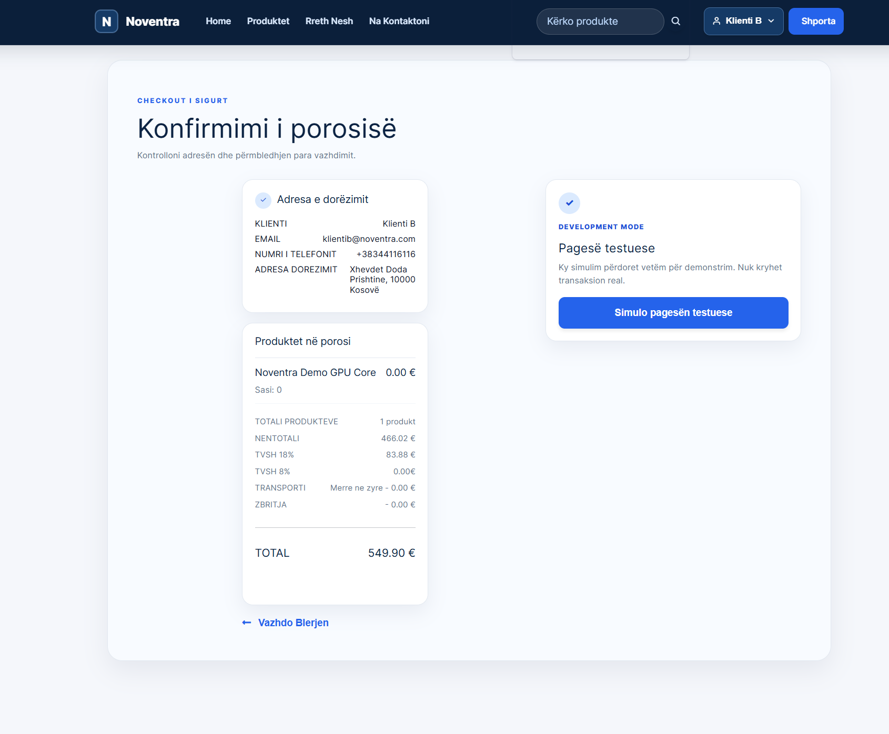
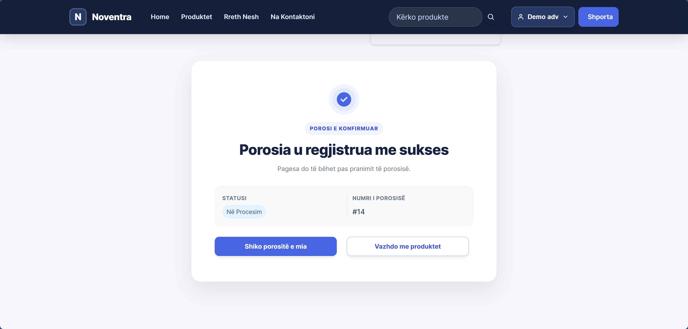
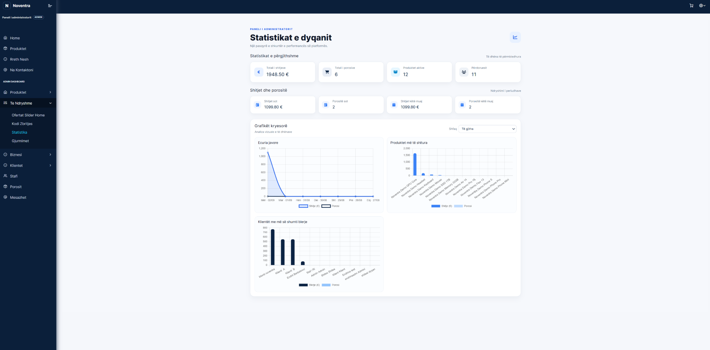

# Noventra

Noventra is a role-based e-commerce platform developed as a bachelor thesis project. It brings product discovery, cart and wishlist workflows, customer profiles, orders, invoices, seller operations, and administration into one commerce system.

This repository is a recruiter-facing showcase rather than a runnable copy of the full application. It contains selected product evidence, a concise architecture note, and short implementation excerpts.

> Selected implementation excerpts are included for technical review. Full source code is available to recruiters upon request.

## My role and engineering contribution

I designed and implemented the platform end to end: React storefront and management surfaces, ASP.NET Core Web API workflows, Entity Framework Core persistence, Identity/JWT authentication, role-aware authorization, cart and order ownership checks, invoice projections, and the development-mode payment boundary. I also worked on validation, responsive UI, idempotent order flows, and the security review that shaped the current API contracts.

## Architecture overview

The React client communicates with an ASP.NET Core Web API. Application services and controllers enforce workflow and ownership rules before Entity Framework Core persists data in SQL Server. Identity and JWT claims support authenticated role boundaries for Client, Seller, and Administrator users.

## Role workflows

- **Client** — searches and filters products, manages a cart and wishlist, maintains profile/address data, reviews checkout totals, places orders, and views invoices and order history.
- **Seller** — manages catalog operations, stock and pricing, and advances orders through the allowed operational status workflow.
- **Administrator** — manages platform users and staff, catalog configuration, promotions, reviews, analytics, and broader operational views.

Role checks are enforced server-side. The interface reflects the role, but the backend remains the authorization authority.

## Technology stack

React · JavaScript · ASP.NET Core Web API · C# · Entity Framework Core · SQL Server · ASP.NET Identity · JWT · Stripe test/development integration

## Checkout and development mock payment

The real checkout boundary calculates totals server-side and verifies the payment state before order finalization. Development also includes a clearly labelled mock-payment mode for demonstrations. The mock flow does not call Stripe, create a real order, change stock, or empty the cart; it is not a financial transaction.

## Security and verification boundaries

- Personal profile, address, cart, wishlist, message, and order reads are scoped to the current authenticated user where applicable.
- Operational routes are role-protected for Seller and Administrator workflows.
- Payment identifiers and client secrets are not presented as ownership proofs.
- This showcase intentionally excludes authentication internals, secrets, migrations, database exports, and webhook implementation details.

## Testing summary

The reference project was validated through backend and frontend builds, whitespace checks, and focused manual verification of authentication/session, role navigation, cart totals, order status, invoice, and development mock-payment flows. The showcase does not claim a complete automated test suite or production deployment; live payment, hosting, monitoring, and exhaustive cross-browser testing remain outside this presentation copy.

## Honest limitations

Noventra is a thesis-scale prototype, not a production SaaS deployment. Stripe is represented in test/development mode, infrastructure is not publicly hosted here, and further hardening would be appropriate for production operations, observability, rate limiting, and release automation.

## Selected screens

### Storefront

### Product detail

### Shopping cart

### Checkout

### Order confirmation

### Administrator dashboard

## Copyright

Copyright © 2026 Endrina Bërbatovci. All rights reserved.

This showcase is provided for portfolio and recruiter review. It is not released under an open-source license.
