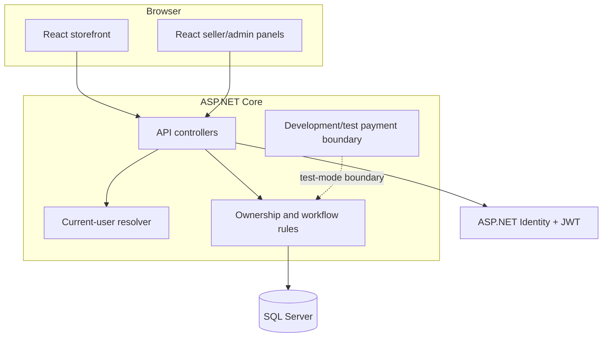

# Noventra architecture

Noventra is organized as a React client over an ASP.NET Core Web API. The API coordinates current-user resolution, role authorization, cart/order workflows, DTO projections, and persistence through Entity Framework Core and SQL Server.

## Boundaries

- React owns presentation, navigation, loading states, and accessible role-aware views.
- API controllers receive requests and map them to narrow response contracts.
- Ownership rules derive the current user from the authenticated server context rather than browser-provided owner identifiers.
- EF Core maps domain relationships to SQL Server; this showcase does not publish schema snapshots or migration history.
- Stripe appears only as a development/test payment boundary. No secret, webhook payload, or card data is included here.

## Main flows

1. A client discovers products and builds a cart.
2. The API recalculates totals and validates current-user ownership at checkout.
3. The order workflow records the order and details, then exposes invoice/order projections.
4. Seller and Administrator roles continue the operational lifecycle through restricted panel actions.

The complete application contains more implementation detail than this public showcase intentionally exposes.
